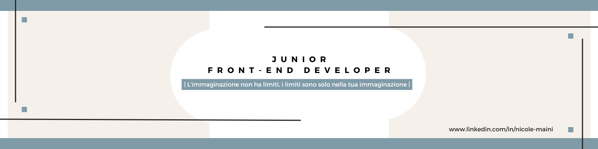

 
<h2 align="center"> Hello pleople!</h2>
 
I'm Nicole, a neo front-end developer from Italy.

 
I'm currently taking a full-stack developer course, and I like to experiment and discover new things about tech and design.  

 
You can find me on <a  href="www.linkedin.com/in/nicole-maini-2190a5285">LinkedIn</a> 

  
  

 

<!--
**NicoleMaini/NicoleMaini** is a ✨ _special_ ✨ repository because its `README.md` (this file) appears on your GitHub profile.

Here are some ideas to get you started:

- 🔭 I’m currently working on ...
- 🌱 I’m currently learning ...
- 👯 I’m looking to collaborate on ...
- 🤔 I’m looking for help with ...
- 💬 Ask me about ...
- 📫 How to reach me: ...
- 😄 Pronouns: ...
- ⚡ Fun fact: ...
-->
